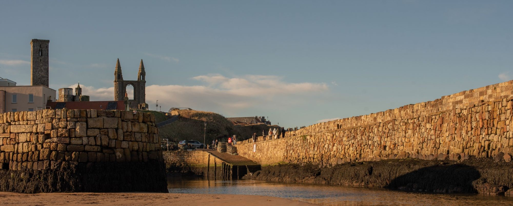

We are pleased to announce that the **Short and long timescales in Speciation Genomics: Machine Learning approaches** (MLSpeciationGenomics) meeting will take place in St Andrews from 24th to 27th June 2025.

How new species emerge is one of the big questions in evolutionary biology. Speciation genomics investigates the genetic basis of this process. Until recently researchers were only able to sequence a few individuals at a single time-point. Yet, with the growing affordability of genome sequencing, it is now possible to consider multiple individuals at multiple points in time.

These multiple time-points could include samples from Natural History Museums, they could be multiple generations of a population housed in controlled laboratory environments or diverse samples collected from the wild. This workshop will bring researchers together to make the best use of the new data, we will have talks as well as hands-on sessions on museum genomics, phylogenomics and machine learning methods.

## Faculty 
Nick Bailey, Rui Borges (University of St Andrews); Svitlana Braichenko (University of Edinburgh); Martin Kapun (Natural History Museum of Vienna); Carolin Kosiol (St Andrews);  Manolo Perez (Imperial College London); Antonio Pacheco; Mike Ritchie (St Andrews); Alexander Suh (Research Museum Koenig Bonn) among others.

## Abstract submission

To submit an abstract please send an email to: MLSpeciationGenomics@gmail.com

## Registration
*  Student Participants £30
*  Academic/ Staff/ Industry Participants £70

*  Register at https://www.eventsforce.net/standrews/264/home

## Important dates

* **21 March 2025**: Webpage goes live
* **11th April 2025**: Deadline for abstracts
* **17th April 2025**: Notification for abstracts
* **24th April 2025**: Deadline for reduced price accomodation booking 
* **2th June 2025**: Registration deadline
